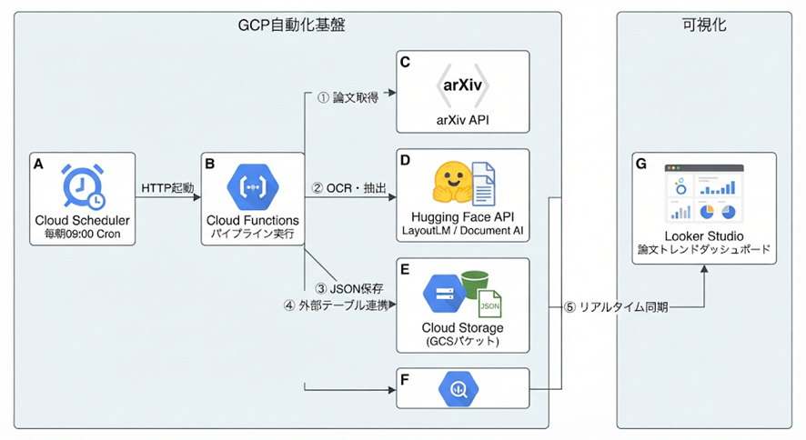

# gcp-arxiv-ocr-pipeline

## 目的：このリポジトリは、arxivの論文を定期的に収集し、最新の話題がどのようなものなのかを可視化するために使用されます。

フローチャートで流れを説明

  ### 実装のロードマップ（3つのフェーズ）                                                                       
                                                                                                                
  手戻りを防ぐため、以下の順序で進めることとする。                                                    
                                                                                                                
* **Phase 1: コアロジックの実装 ＆ テストコード作成（GitHub）**
    * arXiv収集、OCR呼び出し、データ整形のPythonコード作成
    * pytest による単体テスト（Mock利用）＆ 内部結合テスト
    * GitHub Actions でコミット時に自動テストが走る環境の構築
* **Phase 2: GCP基盤の構築（Cloud Functions ＆ Scheduler）**
    * GCSバケットの作成
    * Cloud Functions へのデプロイ
    * Cloud Scheduler で毎朝9時の定期実行を設定
* **Phase 3: BigQuery ＆ Looker Studio でのダッシュボード化**
    * GCSのJSONをBigQueryと紐付け
    * Looker Studio でグラフや一覧表を作成
  